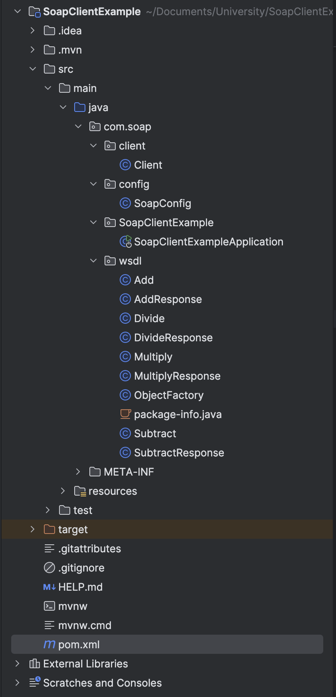

# Manual de Usuario para Consumir el Servicio Web SOAP de una Calculadora

<aside>
📖 Universidad de las Fuerzas Armadas - ESPE
Realizado por:
✅ Cristian Tello
✅ Karol Macas
✅ Mateo Barriga
18 de noviembre de 2024 
🖥️ Aplicaciones Distribuidas - NRC: 2546
🖥️ Proyecto: [https://github.com/M4t3B4rriga/Distribuidas_SOAP](https://github.com/M4t3B4rriga/Distribuidas_SOAP)

</aside>

# **Consumo de un API SOAP utilizando Java y Spring Boot**

Este manual explica cómo consumir un servicio SOAP utilizando **Java** y el framework **Spring Boot**. El ejemplo implementa operaciones de suma, resta, multiplicación y división consumiendo el servicio disponible en el WSDL: http://www.dneonline.com/calculator.asmx?WSDL.

**Requisitos Previos**

1. **Entorno de Desarrollo**:

• Java JDK 17 o superior

• Maven 3.9 o superior

• Un IDE como IntelliJ IDEA o Eclipse

1. **Librerías y Frameworks Utilizados**:

• **Spring Boot**:

- spring-boot-starter-web-services: Para consumir servicios SOAP
- spring-boot-starter: Dependencia básica de Spring Boot

• **JAXB**:

- jaxb-api y jaxb-runtime: Para manejar la serialización y deserialización de objetos XML generados por el WSDL
1. **WSDL del Servicio SOAP**:

• [http://www.dneonline.com/calculator.asmx?WSDL](http://www.dneonline.com/calculator.asmx?WSDL)

**Paso a Paso**

**1. Crear un Proyecto de Spring Boot**

**Generar el proyecto con Spring Initializr**

•	Ir a [https://start.spring.io/](https://start.spring.io/).

•	Configurar el proyecto:

•	**Group**: com.soap.

•	**Artifact**: SoapClientExample.

•	**Dependencies**:

•	Spring Web Services.

•	Spring Boot DevTools.

**Estructura Inicial**

Una vez generado, descomprimir el proyecto y abrirlo en tu IDE.

**2. Agregar Dependencias al Archivo pom.xml**

Agrega las siguientes dependencias al archivo pom.xml para incluir las librerías necesarias:

```jsx
<?xml version="1.0" encoding="UTF-8"?>
<project xmlns="http://maven.apache.org/POM/4.0.0" xmlns:xsi="http://www.w3.org/2001/XMLSchema-instance"
	xsi:schemaLocation="http://maven.apache.org/POM/4.0.0 https://maven.apache.org/xsd/maven-4.0.0.xsd">
	<modelVersion>4.0.0</modelVersion>
	<parent>
		<groupId>org.springframework.boot</groupId>
		<artifactId>spring-boot-starter-parent</artifactId>
		<version>3.3.5</version>
		<relativePath/> <!-- lookup parent from repository -->
	</parent>
	<groupId>com.soap</groupId>
	<artifactId>SoapClientExample</artifactId>
	<version>0.0.1-SNAPSHOT</version>
	<name>SoapClientExample</name>
	<description>Demo project for testing a SOAP service</description>
	<url/>
	<licenses>
		<license/>
	</licenses>
	<developers>
		<developer/>
	</developers>
	<scm>
		<connection/>
		<developerConnection/>
		<tag/>
		<url/>
	</scm>
	<properties>
		<java.version>17</java.version>
	</properties>
	<dependencies>
		<dependency>
			<groupId>org.springframework.boot</groupId>
			<artifactId>spring-boot-starter-web-services</artifactId>
		</dependency>

		<dependency>
			<groupId>org.springframework.boot</groupId>
			<artifactId>spring-boot-devtools</artifactId>
			<scope>runtime</scope>
			<optional>true</optional>
		</dependency>
		<dependency>
			<groupId>org.springframework.boot</groupId>
			<artifactId>spring-boot-starter-test</artifactId>
			<scope>test</scope>
		</dependency>
		<dependency>
			<groupId>jakarta.xml.bind</groupId>
			<artifactId>jakarta.xml.bind-api</artifactId>
			<version>3.0.1</version>
		</dependency>
		<dependency>
			<groupId>jakarta.xml.bind</groupId>
			<artifactId>jakarta.xml.bind-api</artifactId>
			<version>3.0.1</version>
		</dependency>
		<dependency>
			<groupId>org.glassfish.jaxb</groupId>
			<artifactId>jaxb-runtime</artifactId>
			<version>3.0.2</version>
		</dependency>

		<!-- Javax XML Bind for backward compatibility -->
		<dependency>
			<groupId>javax.xml.bind</groupId>
			<artifactId>jaxb-api</artifactId>
			<version>2.3.1</version>
		</dependency>

		<dependency>
			<groupId>org.glassfish.jaxb</groupId>
			<artifactId>jaxb-runtime</artifactId>
			<classifier>sources</classifier>
		</dependency>
	</dependencies>

	<build>
		<plugins>
			<plugin>
				<groupId>org.jvnet.jaxb2.maven2</groupId>
				<artifactId>maven-jaxb2-plugin</artifactId>
				<version>0.14.0</version>
				<executions>
					<execution>
						<goals>
							<goal>generate</goal>
						</goals>
					</execution>
				</executions>
				<configuration>
					<schemaLanguage>WSDL</schemaLanguage>
					<generateDirectory>${project.basedir}/src/main/java</generateDirectory>
					<generatePackage>com.soap.wsdl</generatePackage>
					<schemas>
						<schema>
							<url>http://www.dneonline.com/calculator.asmx?WSDL</url>
						</schema>
					</schemas>
				</configuration>
			</plugin>
		</plugins>
	</build>

</project>

```

**3. Generar las Clases desde el WSDL**

Utiliza el comando wsimport para generar las clases de Java a partir del archivo WSDL del servicio SOAP.

1.	Ejecuta el comando desde la línea de comandos:

```jsx
wsimport -keep -p com.soap.wsdl http://www.dneonline.com/calculator.asmx?WSDL
```

1. Esto generará las clases necesarias para consumir el servicio, como Add, Subtract, Multiply, Divide, y sus respectivas respuestas.
2. Coloca estas clases generadas dentro de src/main/java/com/soap/wsdl.



**4. Configurar el Cliente SOAP**

Crea una clase cliente que interactúe con el servicio SOAP.

**Clase Cliente (Client.java)**

Esta clase utiliza WebServiceGatewaySupport para enviar solicitudes al servicio SOAP.

```jsx
package com.soap.client;

import com.soap.wsdl.*;
import org.springframework.ws.client.core.support.WebServiceGatewaySupport;
import org.springframework.ws.soap.client.core.SoapActionCallback;

public class Client extends WebServiceGatewaySupport {

    public AddResponse getAddResponse(int number1, int number2) {
        Add request = new Add();
        request.setIntA(number1);
        request.setIntB(number2);

        SoapActionCallback callback = new SoapActionCallback("http://tempuri.org/Add");
        return (AddResponse) getWebServiceTemplate()
                .marshalSendAndReceive("http://www.dneonline.com/calculator.asmx", request, callback);
    }

    public SubtractResponse getSubtractResponse(int number1, int number2) {
        Subtract request = new Subtract();
        request.setIntA(number1);
        request.setIntB(number2);

        SoapActionCallback callback = new SoapActionCallback("http://tempuri.org/Subtract");
        return (SubtractResponse) getWebServiceTemplate()
                .marshalSendAndReceive("http://www.dneonline.com/calculator.asmx", request, callback);
    }

    public MultiplyResponse getMultiplyResponse(int number1, int number2) {
        Multiply request = new Multiply();
        request.setIntA(number1);
        request.setIntB(number2);

        SoapActionCallback callback = new SoapActionCallback("http://tempuri.org/Multiply");
        return (MultiplyResponse) getWebServiceTemplate()
                .marshalSendAndReceive("http://www.dneonline.com/calculator.asmx", request, callback);
    }

    public DivideResponse getDivideResponse(int number1, int number2) {
        Divide request = new Divide();
        request.setIntA(number1);
        request.setIntB(number2);

        SoapActionCallback callback = new SoapActionCallback("http://tempuri.org/Divide");
        return (DivideResponse) getWebServiceTemplate()
                .marshalSendAndReceive("http://www.dneonline.com/calculator.asmx", request, callback);
    }
}
```

**5. Configurar el Bean SOAP**

Configura Spring para inicializar y utilizar el cliente SOAP.

**Clase de Configuración (SoapConfig.java)**

```jsx
package com.soap.config;

import com.soap.client.Client;
import org.springframework.context.annotation.Bean;
import org.springframework.context.annotation.Configuration;
import org.springframework.oxm.jaxb.Jaxb2Marshaller;

@Configuration
public class SoapConfig {

    @Bean
    public Jaxb2Marshaller marshaller() {
        Jaxb2Marshaller marshaller = new Jaxb2Marshaller();
        marshaller.setContextPath("com.soap.wsdl");
        return marshaller;
    }

    @Bean
    public Client client(Jaxb2Marshaller marshaller) {
        Client client = new Client();
        client.setDefaultUri("http://www.dneonline.com/calculator.asmx");
        client.setMarshaller(marshaller);
        client.setUnmarshaller(marshaller);
        return client;
    }
}
```

**6. Ejecutar las Operaciones desde main**

Agrega un método CommandLineRunner en la clase principal para ejecutar las operaciones:

**Clase Principal (SoapClientExampleApplication.java)**

```jsx
package com.soap.SoapClientExample;

import com.soap.client.Client;
import com.soap.wsdl.*;
import org.slf4j.Logger;
import org.slf4j.LoggerFactory;
import org.springframework.boot.CommandLineRunner;
import org.springframework.boot.SpringApplication;
import org.springframework.boot.autoconfigure.SpringBootApplication;
import org.springframework.context.annotation.Bean;

@SpringBootApplication
public class SoapClientExampleApplication {

    private static final Logger LOGGER = LoggerFactory.getLogger(SoapClientExampleApplication.class);

    public static void main(String[] args) {
        SpringApplication.run(SoapClientExampleApplication.class, args);
    }

    @Bean
    CommandLineRunner init(Client client) {
        return args -> {
            AddResponse addResponse = client.getAddResponse(10, 20);
            LOGGER.info("Addition Result: {}", addResponse.getAddResult());

            SubtractResponse subtractResponse = client.getSubtractResponse(20, 10);
            LOGGER.info("Subtraction Result: {}", subtractResponse.getSubtractResult());

            MultiplyResponse multiplyResponse = client.getMultiplyResponse(10, 5);
            LOGGER.info("Multiplication Result: {}", multiplyResponse.getMultiplyResult());

            DivideResponse divideResponse = client.getDivideResponse(20, 4);
            LOGGER.info("Division Result: {}", divideResponse.getDivideResult());
        };
    }
}
```

**7. Ejecutar el Proyecto**

1.	Compila y ejecuta el proyecto:

```jsx
mvn spring-boot:run
```

2.	Observa los resultados en la consola:

```jsx
INFO  com.soap.SoapClientExample.SoapClientExampleApplication - Addition Result: 30
INFO  com.soap.SoapClientExample.SoapClientExampleApplication - Subtraction Result: 10
INFO  com.soap.SoapClientExample.SoapClientExampleApplication - Multiplication Result: 50
INFO  com.soap.SoapClientExample.SoapClientExampleApplication - Division Result: 5
```

**Conclusión**

Al seguir estos pasos, podrás consumir cualquier servicio SOAP en Java utilizando Spring Boot. El uso de herramientas como wsimport y el robusto soporte de Spring para servicios web simplifica significativamente la integración con servicios SOAP. Este ejemplo te brindará la base para expandir tus aplicaciones y consumir APIs SOAP de manera eficiente y efectiva.

# Consumo del Servicio Utilizando .NET

Este manual guía al usuario en el proceso en el consumo del servidor web SOAP de una calculadora. El servicio permite realizar las operaciones básicas: suma, resta, multiplicación y división. Se implementa en una aplicación de consola en C# usando Visual Studio y la herramienta dotnet-svcutil.

1. Requisitos Previos
    1. Software Necesario
        - Visual Studio
        - .NET Core SDK
        - dotnet-svcutil instalado
            
             Ejecutar en la terminal:
            
            ```bash
            dotnet tool install --global dotnet-svcutil
            ```
            
    2. Acceso al Servidor
        - URL del servicio SOAP:
        
        [http://www.dneonline.com/calculator.asmx](http://www.dneonline.com/calculator.asmx)
        

2. Instalación del Proyecto

2.1  Crear un Nuevo Proyecto:

- Abre Visual Studio
- Selecciona Crear un nuevo Proyecto
- Escoge Aplicación de Consola (.NET Core)
- Asignar un nombre al proyecto (por ejemplo, SOAPCalculatorClient).

2.2 Generar el Proxy del Servidor:

- Abre una terminal en el directorio del proyecto.
- Ejecuta el siguiente comando para generar las clases del cliente:

```bash
dotnet-svcutil http://www.dneonline.com/calculator.asmx?wsdl
```

- Este comando generará un archivo llamado Reference.cs en el directorio actual, que contiene las clases necesarias para interactuar con el servicio SOAP.

2.3  Agregar el Archivo Generado al Proyecto

Mover el archivo Reference.cs al directorio del proyecto:

- Crea una carpeta en tu proyecto: SOAPCalculatorClient\Services.
- Copia el archivo Reference.cs en esta carpeta.

2.3  Agregar el Archivo Generado al Proyecto:

- Asegúrate de que el archivo generado (`ServiceReference.cs`) esté en la carpeta del proyecto.
- Si no aparece automáticamente, agrégalo manualmente al proyecto desde **Explorador de Soluciones**.

3. Uso del Servidor

1. Código del Program.cs 

```csharp
using System;
using System.Threading.Tasks;
using SOAPCalculatorClient; 
namespace SOAPCalculatorClient
{
    internal class Program
    {
        static async Task Main(string[] args)
        {
            // Crear cliente del servicio
            var client = new CalculatorSoapClient(CalculatorSoapClient.EndpointConfiguration.CalculatorSoap);

            try
            {
                // Ejemplo de operaciones
                Console.WriteLine("== Calculadora SOAP ==");

                int a = 15;
                int b = 5;

                Console.WriteLine($"Sumando {a} + {b}...");
                var suma = await client.AddAsync(a, b);
                Console.WriteLine($"Resultado de la suma: {suma}");

                Console.WriteLine($"Restando {a} - {b}...");
                var resta = await client.SubtractAsync(a, b);
                Console.WriteLine($"Resultado de la resta: {resta}");

                Console.WriteLine($"Multiplicando {a} * {b}...");
                var multiplicacion = await client.MultiplyAsync(a, b);
                Console.WriteLine($"Resultado de la multiplicación: {multiplicacion}");

                Console.WriteLine($"Dividiendo {a} / {b}...");
                var division = await client.DivideAsync(a, b);
                Console.WriteLine($"Resultado de la división: {division}");
            }
            catch (Exception ex)
            {
                Console.WriteLine($"Ocurrió un error: {ex.Message}");
            }
            finally
            {
                // Cerrar el cliente
                if (client.State == System.ServiceModel.CommunicationState.Opened)
                {
                    client.Close(); // Cambiado a Close()
                }
            }

            Console.WriteLine("Presiona cualquier tecla para salir...");
            Console.ReadKey();
        }
    }
}

```

- Se utiliza CalculatorSoapClient para interactuar con el servidor SOAP.
- Se implementan opciones para realizar suma, resta, multiplicación y división. Los resultados se muestran en pantalla.
- Se captura cualquier error durante la comunicación con el servidor.

1. Ejecución del Proyecto
    - Presionamos Ctrl+F5 en Visual Studio para ejecutar la aplicación
    - Visualizamos el resultado por consola


# Consumo del Servicio Utilizando Python

Uso de SOAP en Python
Importacion de las librerías:


La librería de zeep nos permite hacer clientes de Web service esto enfocado en el SOAP. Con esto se puede llegar a consumir APIs.


Consumimos el servicio WSDL


Creamos el cliente SOAP y lo dirigimos a donde queremos que consuma la API
Para inspeccionar los servicios que contiene esta API lo que hacemos es los métodos disponibles que contiene haciendo un recorrido por cliente que contine el WSDL


Luego por medio de consola realizamos las operaciones aritméticas con paso de datos quemados, especificando el método que se quiere usar de la API.


